# Arquitectura del Sistema — ControlF

Diagrama de componentes basado en la implementación real: frontend React/Vite (`controlf_fronted/`), backend Spring Boot de módulo único (`controlF/`), base de datos PostgreSQL y las integraciones externas efectivamente presentes en el código (API de la Asamblea Nacional y Gemini AI).

```plantuml
@startuml
skinparam componentStyle rectangle
left to right direction

actor "Usuario / Navegador" as Browser

node "Frontend (controlf_fronted)\nReact 19 + Vite + TypeScript" as Frontend {
  component "Router\n(react-router-dom)\nApp.tsx" as Router
  component "Componentes de página\n(componentes/*: directorio_politicos,\ndirectorio_leyes, panel_admin,\nvalidacion, alertas, agenda,\nmetricas, comparacion, layout)" as Pages
  component "AuthContext\n(fetch wrapper + JWT en headers)" as AuthContext
  Router --> Pages
  Pages --> AuthContext
}

node "Backend (controlF)\nSpring Boot 4 / Java 21 / Gradle" as Backend {
  component "Controladores REST\n(controller/*)\nAuthController, PoliticoController,\nLeyController, ValidacionController,\nAlertaController, AdminController,\nAssemblyImportController,\nDashboardController" as Controllers

  component "Seguridad JWT\n(auth/*)\nSecurityConfig,\nJwtAuthenticationFilter,\nJwtService,\nCustomUserDetailsService" as Security

  component "Servicios\n(service/*)" as Services

  component "AssemblyImportService" as AssemblyService
  component "GeminiService" as GeminiSvc
  component "RestTemplate\n(config/AppConfig)" as RestTemplateBean

  component "Repositorios JPA\n(db.repository/*)" as Repositories
  component "Entidades\n(db.schema/*, db.schema.enums)" as Entities

  Security --> Controllers : intercepta\n(OncePerRequestFilter)
  Controllers --> Services
  Services --> AssemblyService
  Services --> GeminiSvc
  Services --> Repositories
  AssemblyService --> RestTemplateBean
  GeminiSvc --> RestTemplateBean
  Repositories --> Entities
}

database "PostgreSQL\n(Hibernate ddl-auto=update)" as DB

cloud "API Asamblea Nacional\ndatos.asambleanacional.gob.ec" as Asamblea
cloud "Gemini AI\ngenerativelanguage.googleapis.com" as Gemini

Browser --> Router : HTTP (SPA)
AuthContext --> Controllers : fetch()\n/api/**, /admin/**\n(JWT en Authorization header)

Repositories --> DB : Spring Data JPA

RestTemplateBean --> Asamblea : GET /assembly\n(importación leyes y políticos)
RestTemplateBean --> Gemini : POST /v1beta/models/{model}:generateContent\n(header x-goog-api-key)

note bottom of DB
  docker-compose.yml (raíz) orquesta dos
  contenedores: "database" (postgres:15.3-alpine)
  y "backend" (build ./controlF, puerto 8080).
  El frontend cuenta con su propio Dockerfile
  (controlf_fronted/Dockerfile) pero no está
  incluido en ese docker-compose.yml.
end note

note bottom of GeminiSvc
  Clave de API vía variable de entorno
  GEMINI_API_KEY (app.gemini.api-key).
  Sin valor configurado, el servicio
  responde 503.
end note
@enduml
```

