# Diagrama de Clases — Backend ControlF

Basado exclusivamente en el código fuente de `controlF/src/main/java/com/controlf`. Se omiten getters/setters/constructores generados por Lombok (`@Data`, `@NoArgsConstructor`, `@AllArgsConstructor`, `@RequiredArgsConstructor`) y se muestran solo atributos y métodos públicos relevantes para entender la arquitectura. Dado el volumen de clases (13 entidades, 13 repositorios, 11 servicios, 11 controladores, 6 clases de seguridad, ~60 DTOs), el documento se divide en un diagrama general de paquetes y un diagrama detallado por paquete/módulo.

## Diagrama General (paquetes y dependencias)

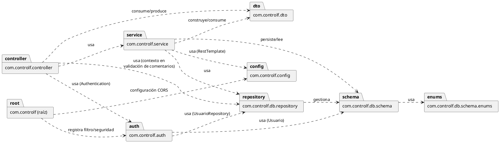

## Módulo: Modelo de Dominio (`db.schema` + `db.schema.enums`)

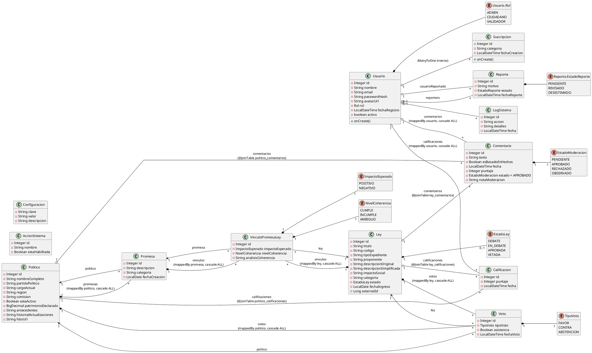

## Módulo: Repositorios (`db.repository`)

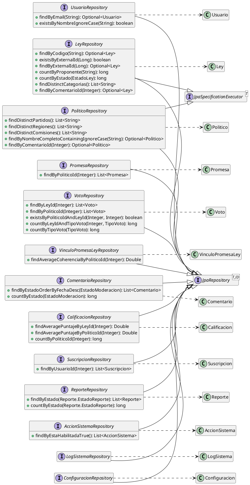

## Módulo: Seguridad (`auth`)

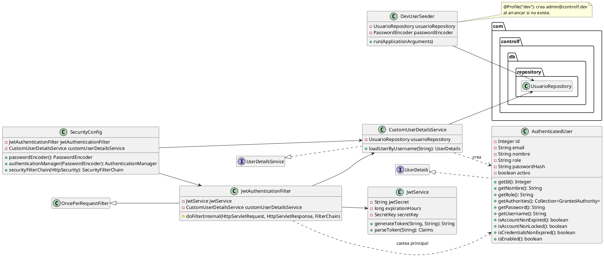

## Módulo: Servicios (`service`)

```plantuml
@startuml
left to right direction
hide empty members

class AdminService {
  -ReporteRepository reporteRepository
  -LogSistemaRepository logRepository
  -DataSource dataSource
  -PromesaRepository promesaRepository
  -LeyRepository leyRepository
  -VinculoPromesaLeyRepository vinculoRepository
  -UsuarioRepository usuarioRepository
  -PoliticoRepository politicoRepository
  -AssemblyImportService assemblyImportService
  -LeyService leyService
  -VotoRepository votoRepository
  +getMotorData(): MotorCoherenciaDataDTO
  +getPromesasByPolitico(Integer): List<SimpleItemDTO>
  +crearPromesa(CrearPromesaRequestDTO)
  +crearVinculoCoherencia(VinculoRequestDTO)
  +ejecutarRespaldo(Integer)
  +limpiarCache()
  +importarLeyes()
  +normalizarLeyes(): LeyNormalizacionResultDTO
  +listarLeyesParaSync(): List<LeySyncItemDTO>
  +syncAllLeyesWithVotingDetails(): LeySyncStatusDTO
  +crearPolitico(CrearPoliticoRequestDTO)
  +crearLey(CrearLeyRequestDTO)
  +eliminarPolitico(Integer)
  +getHistoricoResumen(): ReporteHistoricoDTO
  +getSecurityPanel(): PanelControlDTO
  +getMantenimientoInfo(): PanelMantenimientoDTO
}

class AlertaService {
  -SuscripcionRepository suscripcionRepository
  -UsuarioRepository usuarioRepository
  -LeyRepository leyRepository
  -VotoRepository votoRepository
  +listarSuscripciones(Integer): List<SuscripcionDTO>
  +crearSuscripcion(Integer, String): SuscripcionDTO
  +eliminarSuscripcion(Integer, Integer)
  +obtenerAlertas(Integer): List<AlertaDTO>
}

class AssemblyImportService {
  -LeyRepository leyRepository
  -VotoRepository votoRepository
  -PoliticoRepository politicoRepository
  -RestTemplate restTemplate
  -ObjectMapper objectMapper
  +getAssemblyMembers(): List<AssemblyMemberDTO>
  +importSelectedVotings(Long, List<Long>): ImportResultDTO
  +importLeyesForPoliticos(List<Integer>): ImportResultDTO
  +importVotings(Long): ImportResultDTO
}
note right of AssemblyImportService
  BASE_URL = datos.asambleanacional.gob.ec/ecurul/assemblyman
  (sistema externo, vía RestTemplate)
end note

class DashboardService {
  -PoliticoRepository politicoRepository
  -LeyRepository leyRepository
  -ComentarioRepository comentarioRepository
  -VinculoPromesaLeyRepository vinculoRepository
  -VotoRepository votoRepository
  -CalificacionRepository calificacionRepository
  +getStats(): DashboardStatsDTO
  +getMetricasInteractivas(String, String, String, String): MetricasInteractivasDTO
  +exportPoliticosCsv(): String
  +exportLeyesCsv(): String
  +exportStatsCsv(): String
}

class DataSeederService {
  -PoliticoRepository politicoRepository
  -UsuarioRepository usuarioRepository
  -LeyRepository leyRepository
  -VotoRepository votoRepository
  -PromesaRepository promesaRepository
  -VinculoPromesaLeyRepository vinculoRepository
  -ConfiguracionRepository configuracionRepository
  -ComentarioRepository comentarioRepository
  -CalificacionRepository calificacionRepository
  +seed()
}

class GeminiService {
  -RestTemplate restTemplate
  -String apiKey
  -String model
  +generarExplicacion(String, String): String
}
note right of GeminiService
  Llama a generativelanguage.googleapis.com
  (Gemini AI, sistema externo) vía RestTemplate.
end note

class LeyService {
  -LeyRepository leyRepository
  -VotoRepository votoRepository
  -CalificacionRepository calificacionRepository
  -ComentarioRepository comentarioRepository
  -UsuarioRepository usuarioRepository
  -PoliticoRepository politicoRepository
  -GeminiService geminiService
  +getFiltros(): FiltrosLeyDTO
  +getLeyesFiltradas(int, int, String, String, String): GrillaLeyesDTO
  +getFullPerfilLey(Integer): PerfilLeyDTO
  +getAllLeyesAsExpedientes(): List<ExpedienteLegislativoDTO>
  +getAgendaLegislativa(): AgendaLegislativaDTO
  +getDebatesLegislativos(String): List<DebateLegislativoDTO>
  +actualizarCategoriaLey(Integer, CategoriaLeyRequestDTO)
  +actualizarEstadoLey(Integer, EstadoLeyRequestDTO)
  +actualizarAsistenciaVoto(Integer, Integer, AsistenciaVotoRequestDTO)
  +addComentario(Integer, ComentarioRequestDTO, Integer)
  +addCalificacion(Integer, CalificacionRequestDTO, Integer)
  +getContenidoLey(Integer): ContenidoLeyDTO
  +explicarLey(Integer): ContenidoLeyDTO
  +getDebateCiudadano(Integer): DebateCiudadanoDTO
  +getAuditoriaCoherencia(Integer): AuditoriaCoherenciaDTO
  +getResultadoVotacion(Integer): ResultadoVotacionDTO
  +importVotingDetailVotes(Integer): ImportResultDTO
  +getVotingMatchSummary(Integer): VotingMatchSummaryDTO
}

class PoliticoImportService {
  -PoliticoRepository politicoRepository
  -AssemblyImportService assemblyImportService
  +importAll(): PoliticoImportResultDTO
  +importSelected(List<Long>): PoliticoImportResultDTO
}

class PoliticoService {
  -PoliticoRepository politicoRepository
  -VinculoPromesaLeyRepository vinculoRepository
  -ComentarioRepository comentarioRepository
  -CalificacionRepository calificacionRepository
  -UsuarioRepository usuarioRepository
  -PromesaRepository promesaRepository
  -ConfiguracionRepository configuracionRepository
  -VotoRepository votoRepository
  -ObjectMapper objectMapper
  +getPoliticoProfile(Integer): PerfilPoliticoDTO
  +compararPatronesVoto(List<Integer>): ComparacionVotosDTO
  +getFiltros(): FiltrosPoliticoDTO
  +getPoliticosImportables(): List<SimpleItemDTO>
  +getPoliticosFiltrados(int, int, String, String, String, String): GrillaPoliticosDTO
  +getAllPoliticosAsCartas(): List<CartaPoliticoDTO>
  +actualizarCampoPolitico(Integer, ActualizarCampoPoliticoRequestDTO)
  +addComentario(Integer, ComentarioRequestDTO, Integer)
  +addCalificacion(Integer, CalificacionRequestDTO, Integer)
  +crearPromesa(Integer, PromesaRequestDTO): PromesaDTO
  +listarPromesasPorPolitico(Integer): List<PromesaDTO>
}

class ValidacionService {
  -ComentarioRepository comentarioRepository
  -LeyRepository leyRepository
  -PoliticoRepository politicoRepository
  +listarComentarios(String): List<ComentarioModeracionDTO>
  +contarPorEstado(): Map<String,Long>
  +moderar(Integer, String, String): ComentarioModeracionDTO
}

AdminService --> PromesaRepository
AdminService --> LeyRepository
AdminService --> VinculoPromesaLeyRepository
AdminService --> UsuarioRepository
AdminService --> PoliticoRepository
AdminService --> VotoRepository
AdminService --> ReporteRepository
AdminService --> LogSistemaRepository
AdminService --> AssemblyImportService : delega importación
AdminService --> LeyService : delega import-voting-detail

AlertaService --> SuscripcionRepository
AlertaService --> UsuarioRepository
AlertaService --> LeyRepository
AlertaService --> VotoRepository

AssemblyImportService --> LeyRepository
AssemblyImportService --> VotoRepository
AssemblyImportService --> PoliticoRepository
AssemblyImportService --> "config.AppConfig.RestTemplate" : usa bean

DashboardService --> PoliticoRepository
DashboardService --> LeyRepository
DashboardService --> ComentarioRepository
DashboardService --> VinculoPromesaLeyRepository
DashboardService --> VotoRepository
DashboardService --> CalificacionRepository

DataSeederService --> PoliticoRepository
DataSeederService --> UsuarioRepository
DataSeederService --> LeyRepository
DataSeederService --> VotoRepository
DataSeederService --> PromesaRepository
DataSeederService --> VinculoPromesaLeyRepository
DataSeederService --> ConfiguracionRepository
DataSeederService --> ComentarioRepository
DataSeederService --> CalificacionRepository

GeminiService --> "config.AppConfig.RestTemplate" : usa bean

LeyService --> LeyRepository
LeyService --> VotoRepository
LeyService --> CalificacionRepository
LeyService --> ComentarioRepository
LeyService --> UsuarioRepository
LeyService --> PoliticoRepository
LeyService --> GeminiService : delega explicación IA

PoliticoImportService --> PoliticoRepository
PoliticoImportService --> AssemblyImportService : delega importación

PoliticoService --> PoliticoRepository
PoliticoService --> VinculoPromesaLeyRepository
PoliticoService --> ComentarioRepository
PoliticoService --> CalificacionRepository
PoliticoService --> UsuarioRepository
PoliticoService --> PromesaRepository
PoliticoService --> ConfiguracionRepository
PoliticoService --> VotoRepository

ValidacionService --> ComentarioRepository
ValidacionService --> LeyRepository
ValidacionService --> PoliticoRepository

class PromesaRepository
class LeyRepository
class VinculoPromesaLeyRepository
class UsuarioRepository
class PoliticoRepository
class VotoRepository
class ReporteRepository
class LogSistemaRepository
class SuscripcionRepository
class ComentarioRepository
class CalificacionRepository
class ConfiguracionRepository
@enduml
```

## Módulo: Controladores (`controller`)

```plantuml
@startuml
left to right direction
hide empty members

class AuthController <<@RequestMapping("/api/auth")>> {
  -UsuarioRepository usuarioRepository
  -PasswordEncoder passwordEncoder
  -AuthenticationManager authenticationManager
  -JwtService jwtService
  +register(AuthRegisterRequestDTO): ResponseEntity<?>
  +checkAvailability(Map<String,String>): ResponseEntity<Map<String,Object>>
  +login(AuthLoginRequestDTO): ResponseEntity<?>
  +me(): ResponseEntity<AuthMeResponseDTO>
}

class PoliticoController <<@RequestMapping("/api/politicos")>> {
  -PoliticoService politicoService
  -ComentarioRepository comentarioRepository
  +getPolitico(Integer): PerfilPoliticoDTO
  +getFiltros(): FiltrosPoliticoDTO
  +getImportables(): List<SimpleItemDTO>
  +compararPatronesVoto(List<Integer>): ComparacionVotosDTO
  +getPoliticos(...): GrillaPoliticosDTO
  +actualizarCampo(Integer, ActualizarCampoPoliticoRequestDTO)
  +postComentario(Integer, ComentarioRequestDTO, Authentication)
  +postCalificacion(Integer, CalificacionRequestDTO, Authentication)
  +crearPromesa(Integer, PromesaRequestDTO): ResponseEntity<PromesaDTO>
  +listarPromesas(Integer): List<PromesaDTO>
  +actualizarComentario(Integer, ComentarioRequestDTO, Authentication): ResponseEntity<Void>
  +eliminarComentario(Integer, Authentication): ResponseEntity<Void>
}

class PoliticoImportController <<@RequestMapping("/api/admin")>> {
  -PoliticoImportService politicoImportService
  +importAll(): ResponseEntity<PoliticoImportResultDTO>
  +importSelected(List<Long>): ResponseEntity<PoliticoImportResultDTO>
}

class LeyController <<@RequestMapping("/api/leyes")>> {
  -LeyService leyService
  -ComentarioRepository comentarioRepository
  +getPerfil(Integer): PerfilLeyDTO
  +explicar(Integer): ContenidoLeyDTO
  +getFiltros(): FiltrosLeyDTO
  +getAgenda(): AgendaLegislativaDTO
  +getDebates(String): List<DebateLegislativoDTO>
  +getLeyes(...): GrillaLeyesDTO
  +actualizarCategoria(Integer, CategoriaLeyRequestDTO)
  +actualizarEstado(Integer, EstadoLeyRequestDTO)
  +actualizarAsistencia(Integer, Integer, AsistenciaVotoRequestDTO)
  +postComentario(Integer, ComentarioRequestDTO, Authentication)
  +postCalificacion(Integer, CalificacionRequestDTO, Authentication)
  +importVotingDetail(Integer): ImportResultDTO
  +actualizarComentario(Integer, ComentarioRequestDTO, Authentication): ResponseEntity<Void>
  +eliminarComentario(Integer, Authentication): ResponseEntity<Void>
}

class ValidacionController <<@RequestMapping("/api/validacion")>> {
  -ValidacionService validacionService
  +listarComentarios(String): List<ComentarioModeracionDTO>
  +resumen(): Map<String,Long>
  +moderar(Integer, ModeracionRequestDTO): ComentarioModeracionDTO
}

class AlertaController <<@RequestMapping("/api/alertas")>> {
  -AlertaService alertaService
  +getAlertas(Authentication): List<AlertaDTO>
  +getSuscripciones(Authentication): List<SuscripcionDTO>
  +crearSuscripcion(SuscripcionRequestDTO, Authentication): SuscripcionDTO
  +eliminarSuscripcion(Integer, Authentication)
}

class AdminController <<@RequestMapping("/api/admin")>> {
  -AdminService adminService
  -DataSeederService dataSeederService
  +seedData(): String
  +getMotorData(): MotorCoherenciaDataDTO
  +getPromesas(Integer): List<SimpleItemDTO>
  +crearPromesa(CrearPromesaRequestDTO)
  +crearPolitico(CrearPoliticoRequestDTO)
  +crearLey(CrearLeyRequestDTO)
  +eliminarPolitico(Integer)
  +getPanel(): PanelControlDTO
  +getMantenimiento(): PanelMantenimientoDTO
  +postVinculo(VinculoRequestDTO)
  +postRespaldo()
  +postLimpiarCache()
  +getHistorico(): ReporteHistoricoDTO
  +postImportarLeyes()
  +postNormalizarLeyes(): LeyNormalizacionResultDTO
  +getLeyesSyncables(): List<LeySyncItemDTO>
}

class AssemblyImportController <<@RequestMapping({"/admin","/api/admin"})>> {
  -AssemblyImportService assemblyImportService
  +getAssemblyMembers(): ResponseEntity<List<AssemblyMemberDTO>>
  +getVotings(Long): ResponseEntity<List<VotingDTO>>
  +importSelectedVotings(Long, List<Long>): ResponseEntity<ImportResultDTO>
  +importLeyesForPoliticos(ImportLeyesRequestDTO): ResponseEntity<ImportResultDTO>
  +importVotings(Long): ResponseEntity<ImportResultDTO>
  +handleRuntimeException(RuntimeException): ResponseEntity<String>
}

class DashboardController <<@RequestMapping("/api/dashboard")>> {
  -DashboardService dashboardService
  +getStats(): DashboardStatsDTO
  +getMetricas(...): MetricasInteractivasDTO
  +exportStats(): ResponseEntity<String>
  +exportPoliticos(): ResponseEntity<String>
  +exportLeyes(): ResponseEntity<String>
}

class HolaController {
  +redirect(): String
}

AuthController --> "auth.JwtService"
AuthController --> "db.repository.UsuarioRepository"
PoliticoController --> PoliticoService
PoliticoController --> "db.repository.ComentarioRepository"
PoliticoImportController --> PoliticoImportService
LeyController --> LeyService
LeyController --> "db.repository.ComentarioRepository"
ValidacionController --> ValidacionService
AlertaController --> AlertaService
AdminController --> AdminService
AdminController --> "service.DataSeederService"
AssemblyImportController --> AssemblyImportService
DashboardController --> DashboardService

class PoliticoService
class PoliticoImportService
class LeyService
class ValidacionService
class AlertaService
class AdminService
class AssemblyImportService
class DashboardService
@enduml
```

## Módulo: DTOs — Autenticación y Dashboard (`dto`)

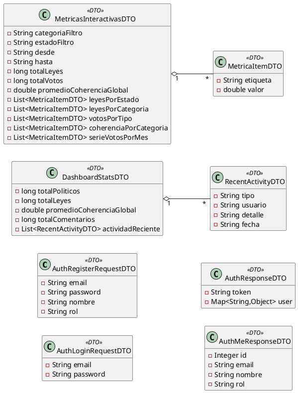

## Módulo: DTOs — Políticos (`dto`)

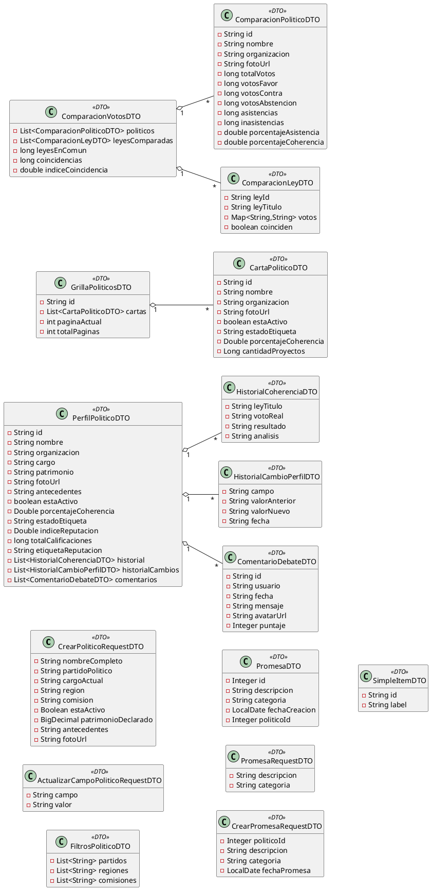

## Módulo: DTOs — Leyes y Coherencia (`dto`)

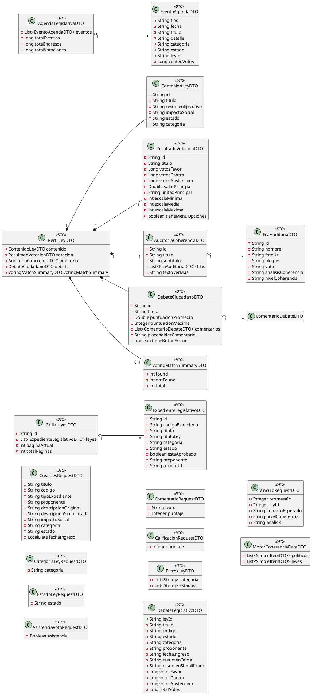

## Módulo: DTOs — Alertas, Validación y Reportes (`dto`)

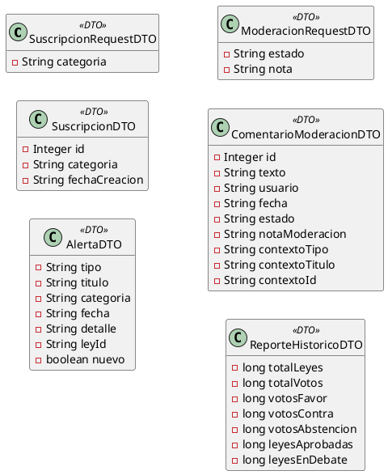

## Módulo: DTOs — Administración e Importación (`dto`)

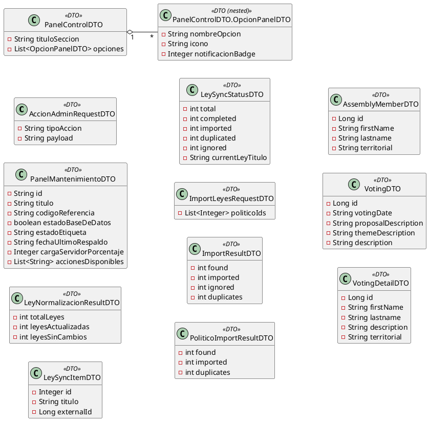
