# Diagramas de Casos de Uso — Proyecto ControlF

## Diagrama General

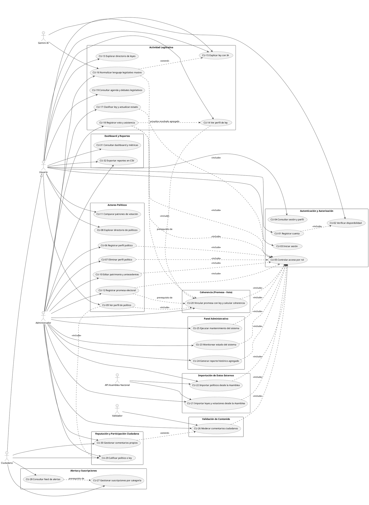

## Módulo: Autenticación y Autorización

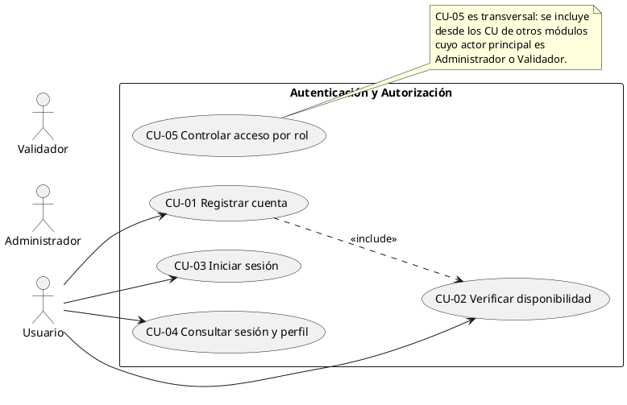

## Módulo: Actores Políticos

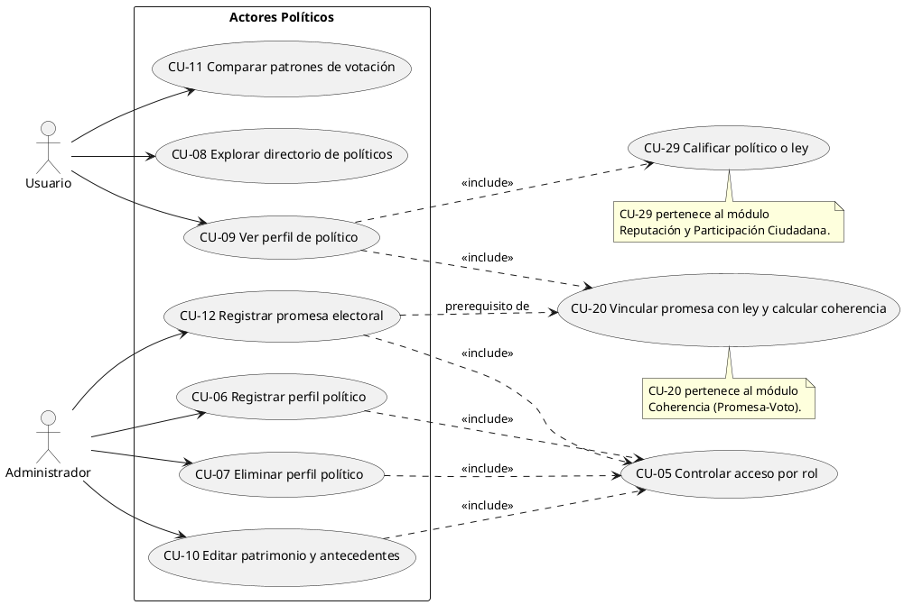

## Módulo: Actividad Legislativa

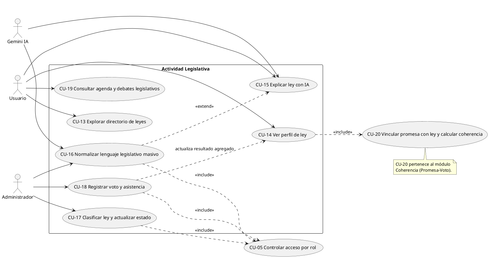

## Módulo: Coherencia (Promesa - Voto)

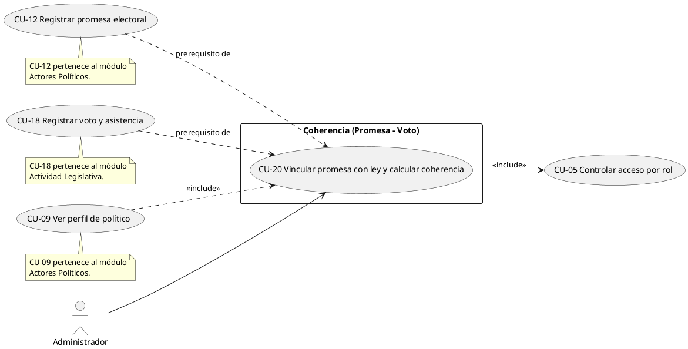

## Módulo: Importación de Datos Externos

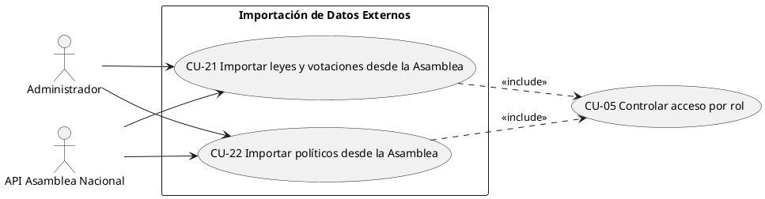

## Módulo: Panel Administrativo

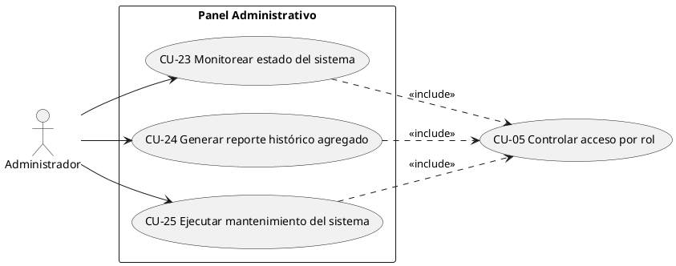

## Módulo: Validación de Contenido

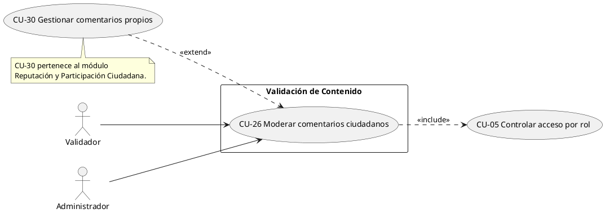

## Módulo: Alertas y Suscripciones

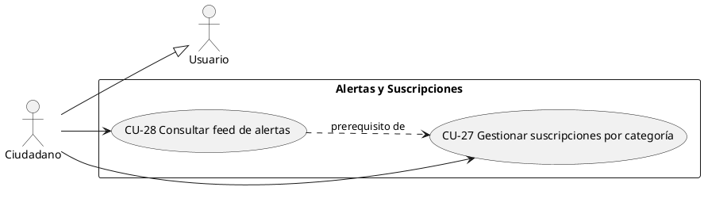

## Módulo: Reputación y Participación Ciudadana

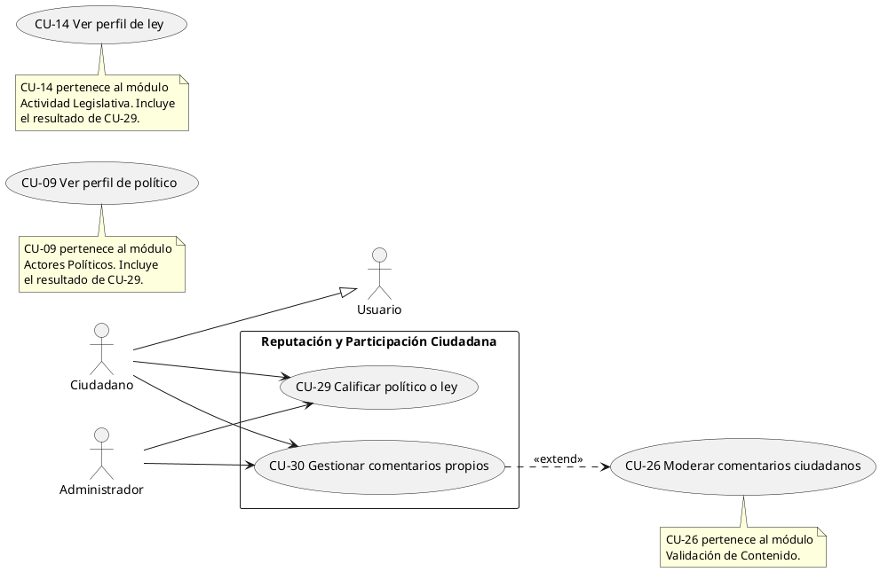

## Módulo: Dashboard y Reportes

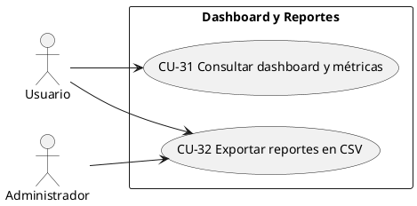
